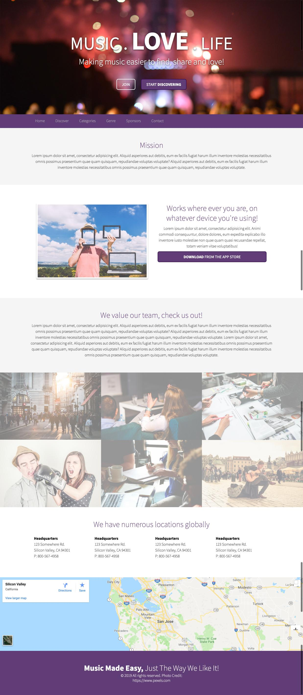
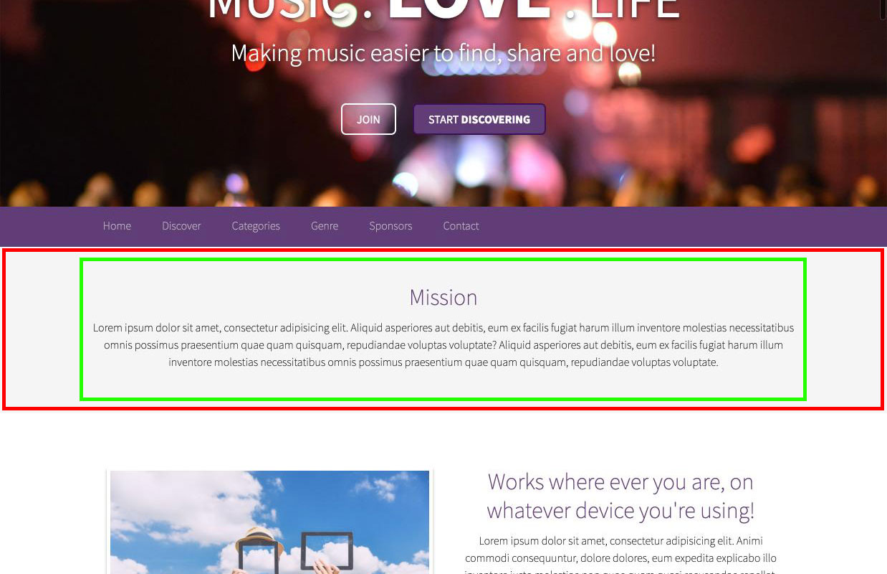
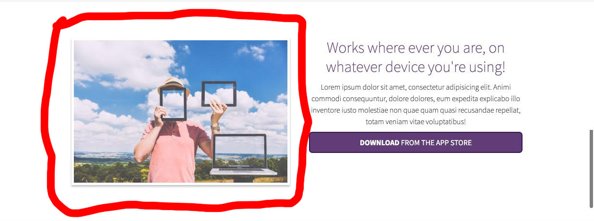
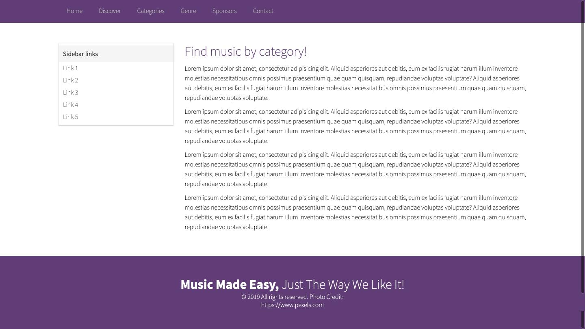
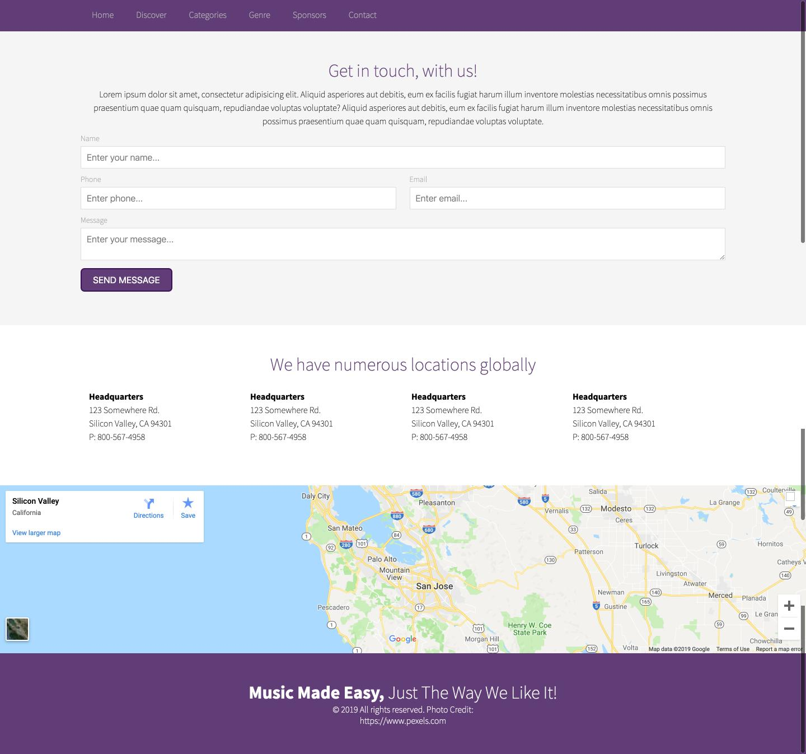

# Tutorial

We'll be building this example website, it will contain three main templates, a homepage, inside and contact us template. We'll start by building this homepage:

[](img/sample-full-finished-example.jpg)

To run this code and view it, go into your command prompt and cd into this directory then run this command:

`php -S localhost:8000`

## Homepage template creation

#### Step 1
- Create an index file, for this tutorial we'll use the `.php` extension so that you can make use of some basic php scripting.
- So in the root directory create a `index.php` file and save it.
- Next inside the `css` directory create a `app.css` file.

These are the basic files you will need to get started.

#### Step 2
- Open up your `index.php` file and let's put a basic boilerplate of code:

```html
<!doctype html>
<html>
<head>
<title>My example</title>
</head>
<body>

</body>
</html>
```

- Let's also link to your stylesheet so that the styles can be reflected inside your `index.php`

```html
<!doctype html>
<html>
<head>
<title>My example</title>

<link rel="stylesheet" href="css/app.css" />
</head>
<body>

</body>
</html>
```

So if we look at the example image, we can basically break the website down into 9 sections:

- Hero section
- Navigation
- Mission
- Device info
- Team about section
- Culture image section
- Locations
- Map
- Footer

If you look at the design we will notice that there are essentially two containers around each section. There is an outside container that spans the full width of the viewable area and an inside container that holds the content within 1170px and centered on the page. Below is a graphic with the outer container highlighted with red and the inside container highlighted with green.

[](img/sample-full-finished-example-container-highlights.jpg)

#### Step 4
Next let's create 4 structural elements, a wrap, container, container__stacked and row. Your wrap will be the red outlined full container, the green outlined area will be a container that has columns sitting side by side in it. The container__stacked will create a container that stacks the inner elements instead of making columns sitting side by side. Finally we will create a row that will be for inner elements that need to be stacked but also have inner elements that are sitting side by side. If this doesn't make sense right now it's fine well explain more in depth later.

So let's add some markup to our example, to create the inner and outer containers, for this well use `section` html tags and `div` tags:

```html
<!doctype html>
<html>
<head>
<title>My example</title>

<link rel="stylesheet" href="css/app.css" />
</head>
<body>

<section class="wrap" id="hero">
    <div class="container">
        
    </div>
</section>

<navigation class="wrap" id="navigation">
    <div class="container">

    </div>
</navigation>

<section class="wrap" id="mission">
    <div class="container">
    
    </div>
</section>

<section class="wrap" id="devices">
    <div class="container">

    </div>
</section>

<section class="wrap" id="our-people">
    <div class="container">
    
    </div>
</section>

<section class="wrap" id="about">
    
</section>

<section class="wrap" id="map-intro">
    <div class="container">
    
    </div>
</section>

<section class="wrap" id="map">
    
</section>

<footer class="wrap" id="footer">
    <div class="container">
    
    </div>
</footer>

<script src="//ajax.googleapis.com/ajax/libs/jquery/2.2.2/jquery.min.js"></script>
<script src="/js/site.js"></script>

</body>
</html>
```

#### Step 5

We'll also link some javascript files near the bottom of the index. It's a similar concept to linking in the stylesheet with a slightly different syntax. Here is an example:
```html
<script src="/path/to/file.js"></script>
```

So let's create a javascript file in the `js` directory called `site.js` and import it, this is what the import would look like:
```html
<script src="/js/site.js"></script>
```

We'll also import in a framework called [jQuery](https://jquery.com/) from a remote site. This will help facilate some minor javascript interactions. Importing will look like this:
```html
<script src="//ajax.googleapis.com/ajax/libs/jquery/2.2.2/jquery.min.js"></script>
```

So altogether, you'll also notice each `wrap` element has an `id` attribute, this is how we will target each major section individually so that we can add things like the background images, background colors and such to the individual containers:

```html
<!doctype html>
<html>
<head>
<title>My example</title>

<link rel="stylesheet" href="css/app.css" />
</head>
<body>

<section class="wrap" id="hero">
    <div class="container">
        
    </div>
</section>

<navigation class="wrap" id="navigation">
    <div class="container">

    </div>
</navigation>

<section class="wrap" id="mission">
    <div class="container">
    
    </div>
</section>

<section class="wrap" id="devices">
    <div class="container">

    </div>
</section>

<section class="wrap" id="our-people">
    <div class="container">
    
    </div>
</section>

<section class="wrap" id="about">
    
</section>

<section class="wrap" id="map-intro">
    <div class="container">
    
    </div>
</section>

<section class="wrap" id="map">
    
</section>

<footer class="wrap" id="footer">
    <div class="container">
    
    </div>
</footer>

<script src="//ajax.googleapis.com/ajax/libs/jquery/2.2.2/jquery.min.js"></script>
<script src="/js/site.js"></script>

</body>
</html>
```

#### Step 6

Let's also add a custom font to help clean up the websites look and feel, we can do this by opening up our `css/app.css` and adding the following line at the top of the file:

```css
@import "//fonts.googleapis.com/css?family=Source+Sans+Pro:400,200,200italic,300,300italic,400italic,600,600italic,700,700italic";
```

A brief explanation, on the web there are webfonts, this allows custom fonts that are not installed on a users computer to be used on the web. Google has an open source [font library](https://fonts.google.com/) that is free to use, it gives you a wide variety of fonts to choose from and it's a resource you don't have to host yourself.

#### Step 7
We'll also add some basic styling overrides to customize the look and feel of our webpage just a bit:

```css
body {
    margin: 0;
    font-family: 'Source Sans Pro', sans-serif;
    font-weight: 100;
    font-size: 1.0em;
}

p {
    font-size: 16px;
}

h1,h2,h3,h4,h5 {
    font-weight: 100;
}

h2 {
    color: #603D77;
    font-size: 32px;
    margin: 0;
}

p {
    margin: 10px 0;
    line-height: 150%;
}

b {
    font-weight: 700;
}

ul {
    list-style: none;
    padding: 0;
    margin: 0;
}

label {
    display: block;
    color: #aaa;
    font-size: 14px;
    margin-bottom: 5px;
}

/**
 *  Helper classes
 */
.img {
    max-width: 100%;
}

.img-thumbnail {
    border: 5px solid #fff;
    -webkit-box-shadow: 0px 3px 5px 0px rgba(0,0,0,0.25);
    -moz-box-shadow: 0px 3px 5px 0px rgba(0,0,0,0.25);
    box-shadow: 0px 3px 5px 0px rgba(0,0,0,0.25);
}
```

At the very top in the `body` rule you'll see this line `font-family: 'Source Sans Pro', sans-serif;` Remember we imported the google font, this essentially tells the entire page to use this font. 

I'm not gonna go into to much detail about what these styles do, they are very basic and mostly resets to the user agent / defaults. The class `.img-thumbnail` is a helper class to give the images just a little bit more styling and make them look a little bit cleaner when displayed on the website. An example of how this class will look when applied to an image is below highlighted in red:

[](img/sample-thumbnail.jpg)

Next let's start some general styles by adding the following lines to the `app.css`:

You'll also notice these three lines in the `.img-thumbnail` styles:

```css
-webkit-box-shadow: 0px 3px 5px 0px rgba(0,0,0,0.25);
-moz-box-shadow: 0px 3px 5px 0px rgba(0,0,0,0.25);
box-shadow: 0px 3px 5px 0px rgba(0,0,0,0.25);
```

This is the same exact rule, the difference is that some of the rules have a `-prefix-`. These prefixes are because not every browser supports code written the same way. These browser prefixes allow the browsers that don't support the plain `box-shadow` rule, unless you have the browser prefix, the browser won't know how to apply this rule. You can find a good more detailed explanation here in this [article](https://www.lifewire.com/css-vendor-prefixes-3466867).

#### Step 8
This `.text-center` and `.text-left` class will allow us to easily align center or left the text inside of whatever tag we apply this class to. It can easily be attached any html tag by doing this `class="text-center"` or `class="text-left"`. Text by default aligns to the left, but there will be times where you may set something to align center, but have child items that need to be left aligned which is where the `.text-left` class will come in handy.

```css
.text-center {
    text-align: center;
}

.text-left {
    text-align: left;
}
```

Here we've targeted to classes, `.wrap` and `container`. You can add multiple selectors by separating them by commas. Below we've added the rule `display: flex;` this tells the browser to display both these elements as [`flex`](https://css-tricks.com/snippets/css/a-guide-to-flexbox/) items.  
```css
.wrap,
.container {
    display: flex;
}
```

Next for the `.container` we want to set a fluid width to the container, this means that the container will change per the screen size to adapt to a variety of devices. Here we've chosen so set the width to `80%` and we also want the container to be centered, which is what `margin: 0 auto;` does. 
```css
.container {
    width: 80%;
    margin: 0 auto;
}
```

Next is a helper container class, by default, when you set an element to display flex, it's children elements will automatically be positioned to set side by side, here we will override this with the `flex-direction` rule, setting it to column.
```css
.container__stacked {
    flex-direction: column;
}
```

The following is another helper class, by add this class similarly the way we did with the `container__stacked` class, we can apply this set of style rules. Here again we are setting the elements `display` to `flex`. This allows the contained elements to sit side by side, this class will be used on elements that are inside a parent that need the elements stacked but then also have an stacked element that will have other side by side inside elements.
```css
.row {
    display: flex;
}
```

From here on out well focus on each individual section, adding the content and styling working from the top down.

#### Step 9
Let's start with the `#hero` section, let's add the following markup:

```html
<section class="wrap" id="hero">
    <div class="container container__stacked text-center">
        <h1>Music . <b>Love</b> . Life</h1>
        <h4>Making music easier to find, share and love!</h4>

        <ul class="hero-btns">
            <li><a class="btn btn-transparent" href="">Join</a></li>
            <li><a class="btn btn-primary" href="">Start <b>discovering</b></a></li>
        </ul>
    </div>
</section>
```

Some things to note:
- Our text is center aligned
- The background image

Next we'll add the styles for the hero section:

Here we'll apply the background image, we'll set the size to cover so that the image stretches to the full width of the container/screen size.  
```css
#hero {
    background: url(/img/people-night.jpg) no-repeat center top;
    background-size: cover;
}
```

This add some padding to the container item, we'll also apply some color and text shadow to the headline:
```css
#hero .container {
    padding: 100px 0;
}

#hero h1, #hero h4 {
    color: #fff;
    text-shadow: 0px 2px 10px rgba(0, 0, 0, 0.75);
}
```

Below are more styles to give the text a bit more life.
```css
#hero h1 {
    font-size: 74px;
    margin: 0;
    text-transform: uppercase;
    font-weight: 400;
}

#hero h1 b {
    font-size: 104px;
}

#hero h4 {
    font-size: 34px;
    margin: 0;
    font-weight: 300;
}
```

#### Step 10

Next well style the buttons, positioning and display within this section:
```css
.hero-btns {
    margin: 50px 0 0;
}

.hero-btns li {
    display: inline-block;
    margin: 0 5px;
}
```

Next let's add some styles to give the buttons the right look and feel, these classes will be able to placed on any link or button and give them this look and feel.
```css
.btn {
    cursor: pointer;
    font-size: 16px;
    display: inherit;
    font-weight: 400;
    border-radius: 7px;
    padding: 10px 20px;
    text-decoration: none;
    -moz-border-radius: 7px;
    text-transform: uppercase;
    -webkit-border-radius: 7px;
}

.btn-transparent {
    color: #fff;
    border: 2px solid #fff;
    background: transparent;
}

.btn-transparent:hover {
    background: rgba(255,255,255,0.1) ;
}

.btn-primary {
    color: #fff;
    border: 2px solid #3B1156;
    background: #603D77;
}

.btn-primary:hover {
    background: #593571;
}
```

In this code you'll notice the `:hover` added to some of the selectors, this is basically saying when the mouse hovers over this item, apply these rules. It gives us the ability to customize styling and give feedback to the user when events happen.

At this point your site should look something like this:

[](img/sample-hero-section.jpg)

#### Step 11

Next let's add the navigational html markup:

```html
<navigation class="wrap" id="navigation">
    <div class="container">
        <ul class="row">
            <li><a href="/">Home</a></li>
            <li><a href="/discover.php">Discover</a></li>
            <li><a href="/categories.php">Categories</a></li>
            <li><a href="/genre.php">Genre</a></li>
            <li><a href="/sponsors.php">Sponsors</a></li>
            <li><a href="/contact.php">Contact</a></li>
        </ul>
    </div>
</navigation>
```

Here we are using a unordered list with links as each one of the list items content. We've added the links to the individual pages, but the pages don't exist so if you click any of the links it will take you to a `Not Found` which is a 404 error page. A 404 error code is part of a set of codes that describe what has happened on a page or resource loaded by the server. More on status codes can be found here in this [article](https://www.restapitutorial.com/httpstatuscodes.html)

Next we'll add some styling:

```css
#navigation {
    background: #603D77;
}

#navigation a {
    color: #bbb;
    font-size: 16px;
    text-decoration: none;
    padding: 15px 20px;
    display: inherit;
    border-top: 1px solid transparent;
    border-bottom: 5px solid transparent;
}

#navigation a:hover {
    color: #fff;
    background: #513067;
    border-top: 1px solid #C3A3D8;
    border-bottom: 5px solid #3B1156;
}
```

#### Step 12

Let's create the mission section next:

```html
<section class="wrap" id="mission">
    <div class="container container__stacked text-center">
        <h2>Mission</h2>
        <p>Lorem ipsum dolor sit amet, consectetur adipisicing elit. Aliquid asperiores aut debitis, eum ex facilis fugiat harum illum inventore molestias necessitatibus omnis possimus praesentium quae quam quisquam, repudiandae voluptas voluptate? Aliquid asperiores aut debitis, eum ex facilis fugiat harum illum inventore molestias necessitatibus omnis possimus praesentium quae quam quisquam, repudiandae voluptas voluptate.</p>
    </div>
</section>
```

Let's give this section a slightly different background, we'll also add the `#our-people` to apply this styling to this element as well: 

```css
#mission,
#our-people {
    background: #f5f5f5;
}
```

#### Step 13

Let's add the devices section markup:

```html
<section class="wrap" id="devices">
    <div class="container text-center">
        <div class="column">
            
        </div>
        <div class="column">
            <h2>Works where ever you are, on whatever device you're using!</h2>

            <p>Lorem ipsum dolor sit amet, consectetur adipisicing elit. Animi commodi consequuntur, dolore dolores, eum expedita explicabo illo inventore iusto molestiae non quae quam quasi recusandae repellat, totam veniam vitae voluptatibus!</p>

            <a class="btn btn-primary" href=""><b>Download</b> from the app store</a>
        </div>
    </div>
</section>
```

#### Step 14

We'll a little about us content:

```html
<section class="wrap" id="our-people">
    <div class="container container__stacked text-center">
        <h2>We value our team, check us out!</h2>
        <p>Lorem ipsum dolor sit amet, consectetur adipisicing elit. Aliquid asperiores aut debitis, eum ex facilis fugiat harum illum inventore molestias necessitatibus omnis possimus praesentium quae quam quisquam, repudiandae voluptas voluptate? Aliquid asperiores aut debitis, eum ex facilis fugiat harum illum inventore molestias necessitatibus omnis possimus praesentium quae quam quisquam, repudiandae voluptas voluptate. Lorem ipsum dolor sit amet, consectetur adipisicing elit. Aliquid asperiores aut debitis, eum ex facilis fugiat harum illum inventore molestias necessitatibus omnis possimus praesentium quae quam quisquam, repudiandae voluptas voluptate? Aliquid asperiores aut debitis, eum ex facilis fugiat harum illum inventore molestias necessitatibus omnis possimus praesentium quae quam quisquam, repudiandae voluptas voluptate.</p>
    </div>
</section>
```

#### Step 15

We're gonna add a nice montage to help show a little bit of the company culture. The images are supplied by [Pexels](https://www.pexels.com/), it's a great completely free option for finding stock photos that you can use. Again here we'll use a unordered list tag with list items containing an image element.
```html
<section class="wrap" id="about">
    <ul class="row">
        <li></li>
        <li></li>
        <li></li>
        <li></li>
        <li></li>
        <li></li>
    </ul>
</section>
```

Just a bit about `flex-wrap`, below you'll notice something new and different than anything that we've done before. `flex-wrap: wrap;` This essentially allows us to apply a width to all the child elements, and if the number of total elements exceeds the container width then to wrap the elements causing them to go down to the next line.
```css
#about ul {
    flex-wrap: wrap;
}
```

Below we see `flex: 1 1 33.333333%;` this a shorthand way of writing the flex rules. This is actually the exact same as:

```css
flex-grow: 1;
flex-shrink: 1;
flex-basis: 33.3333%;
```

It gives us a shorthand quicker way of writing the above.

```css
#about li {
    line-height: 0;
    flex: 1 1 33.333333%;
}
```

We'll also added a bit of style so that when someone hovers the image the opacity will go from 50% to 100% opaque. You'll also notice the `max-width` which means there is no width defined unless the image is wider than the containing element.
```css
#about img {
    opacity: .5;
    max-width: 100%;
}

#about img:hover {
    opacity: 1;
}
```

#### Step 16

Let's now add a locations section, this could be for multiple office locations etc:

```html
<section class="wrap" id="map-intro">
    <div class="container container__stacked">
        <h2 class="text-center">We have numerous locations globally</h2>

        <div class="row">
            <div class="address">
                <p><b>Headquarters</b><br/>
                    123 Somewhere Rd.<br/>
                    Silicon Valley, CA 94301<br/>
                    P: 800-567-4958</p>
            </div>

            <div class="address">
                <p><b>Headquarters</b><br/>
                    123 Somewhere Rd.<br/>
                    Silicon Valley, CA 94301<br/>
                    P: 800-567-4958</p>
            </div>

            <div class="address">
                <p><b>Headquarters</b><br/>
                    123 Somewhere Rd.<br/>
                    Silicon Valley, CA 94301<br/>
                    P: 800-567-4958</p>
            </div>

            <div class="address">
                <p><b>Headquarters</b><br/>
                    123 Somewhere Rd.<br/>
                    Silicon Valley, CA 94301<br/>
                    P: 800-567-4958</p>
            </div>
        </div>
    </div>
</section>
```

Just a bit of css to add some padding and tell the items to be equal width by specifying `flex: 1;`

```css
.address {
    flex: 1;
    padding: 15px;
    box-sizing: border-box;
}
```

#### Step 17

The next section is kind of special, we are going to basically utilize [Google Maps](https://maps.google.com/) and it's embed option to create a full width panning map. Google allows you to display a map on your webpage easily, using there [embed option](https://www.google.com/maps?ll=37.396258,-122.041098&z=9&t=m&hl=en-US&gl=US&mapclient=embed&q=Silicon+Valley+California). 

The only thing we are going to different is remove a couple attributes, specifically the `height` and `width`. Google automatically in it's embed code supplies those attributes, but we want to strip them and use css to style the map. Below is a direct example of what the google embed code looks like:

`<iframe src="https://www.google.com/maps/embed?pb=!1m14!1m8!1m3!1d811450.4365352363!2d-122.041098!3d37.396258!3m2!1i1024!2i768!4f13.1!3m3!1m2!1s0x808fb68ad0cfc739%3A0x7eb356b66bd4b50e!2sSilicon+Valley%2C+CA!5e0!3m2!1sen!2sus!4v1552932162631" width="600" height="450" frameborder="0" style="border:0" allowfullscreen></iframe>`

So what we want is:

``<iframe src="https://www.google.com/maps/embed?pb=!1m14!1m8!1m3!1d811450.4365352363!2d-122.041098!3d37.396258!3m2!1i1024!2i768!4f13.1!3m3!1m2!1s0x808fb68ad0cfc739%3A0x7eb356b66bd4b50e!2sSilicon+Valley%2C+CA!5e0!3m2!1sen!2sus!4v1552932162631" frameborder="0" style="border:0" allowfullscreen></iframe>``

Which you see below:

```html
<section class="wrap" id="map">
    <iframe src="https://www.google.com/maps/embed?pb=!1m18!1m12!1m3!1d405691.57240383344!2d-122.3212843181106!3d37.40247298383319!2m3!1f0!2f0!3f0!3m2!1i1024!2i768!4f13.1!3m3!1m2!1s0x808fb68ad0cfc739%3A0x7eb356b66bd4b50e!2sSilicon+Valley%2C+CA!5e0!3m2!1sen!2sus!4v1458624896221" frameborder="0" style="border:0" allowfullscreen></iframe>
</section>
```

Now we said we'd handle some aspects of the embed code via our stylesheet:

```css
#map iframe {
    width: 100%;
    height: 300px;
}
```

Here we are just telling it to take up the containers full width and have a height of 300px.

#### Step 18

Finally our final step for the homepage, adding the footer:

```html
<footer class="wrap" id="footer">
    <div class="container container__stacked text-center">
        <h2><b>Music Made Easy,</b> Just The Way We Like It!</h2>

        &copy; <?php echo date('Y'); ?> All rights reserved.
        Photo Credit: <a target="_blank" href="https://www.pexels.com/">https://www.pexels.com</a>
    </div>
</footer>
```

We'll add some basic styling to give the text a cleaner look:

```css
#footer {
    background: #603D77;
    color: #fff;
}

#footer h2 {
    color: #fff;
}

#footer a {
    color: #fff;
    text-decoration: none;
}

#footer a:hover {
    text-decoration: underline;
}
```

#### Step 19

Now that we've completed the homepage let's look at how we can clean up the code a bit. For this next part, we're gonna use a little bit of `php`, specifically we'll use the `require` function. This function is supplied a path to a file and includes whatever code is in it, into the file that utilizes the `require` function.  

For our example we'll section by section externalize the parts that will be used in different areas. So well externalize these sections:

- `hero -> lib/homepage-hero.php`
- `header -> lib/header.php`
- `map -> lib/map.php`
- `locations -> lib/locations.php`
- `footer -> lib/footer.php`

So for the hero section, in our `index.php` we'll add this line:

```html
<?php require 'lib/homepage-hero.php'; ?>
```

In that file we'll put this markup:

```html
<section class="wrap" id="hero">
    <div class="container container__stacked text-center">
        <h1>Music . <b>Love</b> . Life</h1>
        <h4>Making music easier to find, share and love!</h4>

        <ul class="hero-btns">
            <li><button class="btn btn-transparent" href="">Join</button></li>
            <li><a class="btn btn-primary" href="">Start <b>discovering</b></a></li>
        </ul>
    </div>
</section>
```

So when `php` reads the `index.php` and sees the require line it will grab the contents of the file and replace the require line with the content. So go and do that for each of the sections listed above, after you've done that your code should look like this:

```html
<!doctype html>
<html>
<head>
<title>Basic Demo Tutorial</title>

<link href='https://fonts.googleapis.com/css?family=Source+Sans+Pro:400,200,200italic,300,300italic,400italic,600,600italic,700,700italic' rel='stylesheet' type='text/css'>
<link rel="stylesheet" href="css/app.css" />

</head>
<body>

<?php require 'lib/homepage-hero.php'; ?>

<?php require 'lib/header.php'; ?>

<section class="wrap" id="mission">
    <div class="container container__stacked text-center">
        <h2>Mission</h2>
        <p>Lorem ipsum dolor sit amet, consectetur adipisicing elit. Aliquid asperiores aut debitis, eum ex facilis fugiat harum illum inventore molestias necessitatibus omnis possimus praesentium quae quam quisquam, repudiandae voluptas voluptate? Aliquid asperiores aut debitis, eum ex facilis fugiat harum illum inventore molestias necessitatibus omnis possimus praesentium quae quam quisquam, repudiandae voluptas voluptate.</p>
    </div>
</section>

<section class="wrap" id="devices">
    <div class="container text-center">
        <div class="column">
            
        </div>
        <div class="column">
            <h2>Works where ever you are, on whatever device you're using!</h2>

            <p>Lorem ipsum dolor sit amet, consectetur adipisicing elit. Animi commodi consequuntur, dolore dolores, eum expedita explicabo illo inventore iusto molestiae non quae quam quasi recusandae repellat, totam veniam vitae voluptatibus!</p>

            <a class="btn btn-primary" href=""><b>Download</b> from the app store</a>
        </div>
    </div>
</section>

<section class="wrap" id="our-people">
    <div class="container container__stacked text-center">
        <h2>We value our team, check us out!</h2>
        <p>Lorem ipsum dolor sit amet, consectetur adipisicing elit. Aliquid asperiores aut debitis, eum ex facilis fugiat harum illum inventore molestias necessitatibus omnis possimus praesentium quae quam quisquam, repudiandae voluptas voluptate? Aliquid asperiores aut debitis, eum ex facilis fugiat harum illum inventore molestias necessitatibus omnis possimus praesentium quae quam quisquam, repudiandae voluptas voluptate. Lorem ipsum dolor sit amet, consectetur adipisicing elit. Aliquid asperiores aut debitis, eum ex facilis fugiat harum illum inventore molestias necessitatibus omnis possimus praesentium quae quam quisquam, repudiandae voluptas voluptate? Aliquid asperiores aut debitis, eum ex facilis fugiat harum illum inventore molestias necessitatibus omnis possimus praesentium quae quam quisquam, repudiandae voluptas voluptate.</p>
    </div>
</section>

<section class="wrap" id="about">
    <ul class="row">
        <li></li>
        <li></li>
        <li></li>
        <li></li>
        <li></li>
        <li></li>
    </ul>
</section>

<?php require 'lib/locations.php'; ?>

<?php require 'lib/map.php'; ?>

<?php require 'lib/footer.php'; ?>

<script src="https://ajax.googleapis.com/ajax/libs/jquery/2.2.2/jquery.min.js"></script>
<script src="/js/site.js"></script>

</body>
</html>
```

## Inside page template
Next well create our inside page template, this page will be very simple. It will have the header, footer and main content area. Note: All content in this site is fictious and completely made up to give us the look and feel of what a real website would look like. Below is a graphic example of the inside page:

[](img/sample-inside-page.jpg)

#### Step 1
We'll utilize our `lib/header.php` and `lib/footer.php` files to import the global sections. The main content area will be have a sidebar on the left and a main content area on the right.

```html
<!doctype html>
<html>
<head>
<title>Basic Demo Tutorial | Sponsors</title>

<link href='https://fonts.googleapis.com/css?family=Source+Sans+Pro:400,200,200italic,300,300italic,400italic,600,600italic,700,700italic' rel='stylesheet' type='text/css'>
<link rel="stylesheet" href="css/app.css" />

</head>
<body>

<?php require 'lib/header.php'; ?>


<?php require 'lib/footer.php'; ?>

</body>
</html>
```

#### Step 2

In between our header and footer include we'll place the following markup:

```html
<div class="wrap inside-page-content" id="sponsors">
    <div class="container">

        <div class="sidebar">

            <div class="module">
                <div class="module-header">
                    <h4>Sidebar links</h4>
                </div>
                <div class="module-content">
                    <ul>
                        <li><a href="">Link 1</a></li>
                        <li><a href="">Link 2</a></li>
                        <li><a href="">Link 3</a></li>
                        <li><a href="">Link 4</a></li>
                        <li><a href="">Link 5</a></li>
                    </ul>
                </div>
            </div>

        </div>
        <div class="content">
            <h2>We have a lot of great people, that helped us make this possible!</h2>

            <p>Lorem ipsum dolor sit amet, consectetur adipisicing elit. Aliquid asperiores aut debitis, eum ex facilis fugiat harum illum inventore molestias necessitatibus omnis possimus praesentium quae quam quisquam, repudiandae voluptas voluptate? Aliquid asperiores aut debitis, eum ex facilis fugiat harum illum inventore molestias necessitatibus omnis possimus praesentium quae quam quisquam, repudiandae voluptas voluptate.</p>
            <p>Lorem ipsum dolor sit amet, consectetur adipisicing elit. Aliquid asperiores aut debitis, eum ex facilis fugiat harum illum inventore molestias necessitatibus omnis possimus praesentium quae quam quisquam, repudiandae voluptas voluptate? Aliquid asperiores aut debitis, eum ex facilis fugiat harum illum inventore molestias necessitatibus omnis possimus praesentium quae quam quisquam, repudiandae voluptas voluptate.</p>
            <p>Lorem ipsum dolor sit amet, consectetur adipisicing elit. Aliquid asperiores aut debitis, eum ex facilis fugiat harum illum inventore molestias necessitatibus omnis possimus praesentium quae quam quisquam, repudiandae voluptas voluptate? Aliquid asperiores aut debitis, eum ex facilis fugiat harum illum inventore molestias necessitatibus omnis possimus praesentium quae quam quisquam, repudiandae voluptas voluptate.</p>
            <p>Lorem ipsum dolor sit amet, consectetur adipisicing elit. Aliquid asperiores aut debitis, eum ex facilis fugiat harum illum inventore molestias necessitatibus omnis possimus praesentium quae quam quisquam, repudiandae voluptas voluptate? Aliquid asperiores aut debitis, eum ex facilis fugiat harum illum inventore molestias necessitatibus omnis possimus praesentium quae quam quisquam, repudiandae voluptas voluptate.</p>
        </div>

    </div>
</div>
```

This gives us the full content of the inside page. Using this templated approach we make things much more efficient, maintainable and easier to read. Let's add some basic styling for the new markup:

#### Step 4

These lines basically say, we want to divide the container width into 4 parts. Of that 4 parts we want the sidebar to take 1/4 or 25% and the main content area to take 3/4 or 75% of the width. We accomplish that by applying `flex: 1;` to the `.sidebar` and `flex: 3;` to the `.content` classes.

```css
.inside-page-content .sidebar {
    flex: 1;
}

.inside-page-content .content {
    flex: 3;
    margin-left: 30px;
}
```

#### Step 5

This next step is a little more interesting, we've named the classes generically so that this set of code and styles can be reused. Right now we just have a set of example links in the sidebar and we've styled it to look like a box with a header and content area.
```css
.module {
    display: flex;
    padding: 5px 0;
    background: #fff;
    border: 1px solid #f5f5f5;
    box-shadow: 0px 1px 3px 0px rgba(0,0,0,0.25);
    -moz-box-shadow: 0px 1px 3px 0px rgba(0,0,0,0.5);
    -webkit-box-shadow: 0px 1px 3px 0px rgba(0,0,0,0.5);
}

.module .module-header {
    background: #f5f5f5;
}

.module .module-header h4 {
    margin: 0;
    color: #333;
    padding: 10px;
    font-weight: 400;
}

.module a {
    color: #666;
    display: flex;
    padding: 5px 10px;
    text-decoration: none;
}

.module a:hover {
    background: #f5f5f5;
}
```

And that is about it for the inside page template.

#### Step 6
Now take this file and copy and paste it for everyone of the items below naming it the text below:

- categories.php
- discover.php
- genre.php
- sponsors.php

#### Step 7

Once you've created all of these files if you open each on individually you'll see the following code:

```html
<div class="content">
    <h2>Discover new music!</h2>
</div>
```

I would go ahead and change that `<h2>` tag and put some kind of text related to the filename. For instance for `genre.php` maybe replace the title text with something like `Find music by genre!` and for `sponsors.php` maybe something like `We have a lot of great people, that helped us make this possible!`. This way when you are actually navigating to different pages you'll see the content change.

## Contact us page
Onto the fun part writing a page that will actually receive textual input from a user and do something with it. Just a quick disclaimer: We will be using a native php function to send email, you should **NOT** do this in a production environment! Below is an example of what the page will look like after we complete it:

[](img/sample-contact-us-template.jpg)

So let's go ahead and first create the html markup for page:
 
#### Step 1
Start by copying and pasting one of the previous inside page templates and renaming it to `contact.php`.

#### Step 2 

Let's get rid of everything in the content area and make sure to require the following files:

```html
<!doctype html>
<html>
<head>
<title>Basic Demo Tutorial</title>

<link href='https://fonts.googleapis.com/css?family=Source+Sans+Pro:400,200,200italic,300,300italic,400italic,600,600italic,700,700italic' rel='stylesheet' type='text/css'>
<link rel="stylesheet" href="css/app.css" />

</head>
<body>

<?php require 'lib/header.php'; ?>


<?php require 'lib/locations.php'; ?>

<?php require 'lib/map.php'; ?>

<?php require 'lib/footer.php'; ?>

</body>
</html>
```

#### Step 3

Now that we have this in place we can add the actual form code:

```html
<div class="wrap" id="contact-form">
    <div class="container container__stacked text-center">
        <h2>Get in touch, with us!</h2>
        <p>Lorem ipsum dolor sit amet, consectetur adipisicing elit. Aliquid asperiores aut debitis, eum ex facilis fugiat harum illum inventore molestias necessitatibus omnis possimus praesentium quae quam quisquam, repudiandae voluptas voluptate? Aliquid asperiores aut debitis, eum ex facilis fugiat harum illum inventore molestias necessitatibus omnis possimus praesentium quae quam quisquam, repudiandae voluptas voluptate.</p>

        <form action="process/contact.php" method="post" class="text-left">

            <div class="form-group width-full">
                <label for="name">Name</label>
                <input type="text" class="form-control" name="name" id="name" placeholder="Enter your name..." />
            </div>

            <div>
                <div class="form-group width-half">
                    <label for="phone">Phone</label>
                    <input type="text" class="form-control" name="phone" id="phone" placeholder="Enter phone..." />
                </div>
                <div class="form-group width-half">
                    <label for="email">Email</label>
                    <input type="text" class="form-control" name="email" id="email" placeholder="Enter email..." />
                </div>
            </div>

            <div class="form-group width-full">
                <label for="message">Message</label>
                <textarea class="form-control" name="message" id="message" placeholder="Enter your message..."></textarea>
            </div>

            <div class="form-group">
                <button type="submit" class="btn btn-primary">Send message</button>
            </div>

        </form>
    </div>
</div>
```

We won't discuss to in depth what this code does, mostly its some basic html with a form element and some form input tags. We'll describe a few things on a very high level:

```html
<form action="process/contact.php" method="post" class="text-left">
```
This is the opening `form` tag, it denotes that all of the child elements should be recognized as part of this form. The `action` attribute is the file that will be used to process the input from this form. The `method` is how we handle and send data to the server, the most common are `post` and `get` but there are many others. A more in detail description can be found in [this article](https://developer.mozilla.org/en-US/docs/Learn/HTML/Forms/Sending_and_retrieving_form_data). You can find more on html form elements [here](../basics.md#user-content-html-form-inputs)

Next well briefly discuss how input works, since we are using the `post` method for sending the form data, when we go to process data and grab something like the user input for the `name="name"` input, we'll have to access the value like so:

```php
$name = $_POST['name'];
```

Had we used `get` as the `method`, we would access the name this way:

```php
$name = $_GET['name'];
``` 

Pretty simple right? The following is a label and single line text input field:

```html
<label for="name">Name</label>
<input type="text" class="form-control" name="name" id="name" placeholder="Enter your name..." />
```

The `label` attribute `for` must equal the `id` attribute on the `input`. This will allow for when the `label` is clicked to automatically focus into the the corresponding text input field. The `name` attribute and `id` attribute must be unique for every form element.

Buttons have the `type` attribute, we've set the attribute to `type="submit"`. This tells the form that when the button is clicked to submit this form or run the `action` attribute. 

#### Step 4
Adding some css to style the form.

```css
#contact-form {
    background: #f5f5f5;
}

.form-control {
    width: 100%;
    padding: 10px;
    border: 1px solid #ddd;
    font-size: 16px;
    color: #aaa;
    font-weight: 100;
    box-sizing: border-box;
}

.form-group {
    float: left;
    margin-bottom: 10px;
}

.width-full {
    width: 100%;
}

.width-half {
    width: 49%;
}

.width-half:first-child {
    margin-right: 2%;
}
```

Now that we have the form let's start to work on the interactive part!